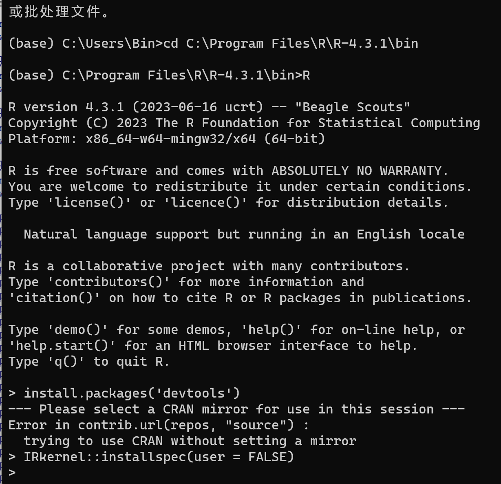

# 多元统计分析课程资料

## 此页面为2023-2024第一学期《多元统计分析》课程资料，包含：

- 教学用的slides
- 教学代码（分别支持*.R何*.ipynb两种扩展名），可支持在R Studio 或者Jupyter下运行
- 课后作业及答案

## Jupyter安装R语言插件的教程（Windows）

- 切换到R的bin目录下，然后参考（https://dzone.com/articles/using-r-on-jupyternbspnotebook）

- 启动 jupyter lab，选择R环境
  
